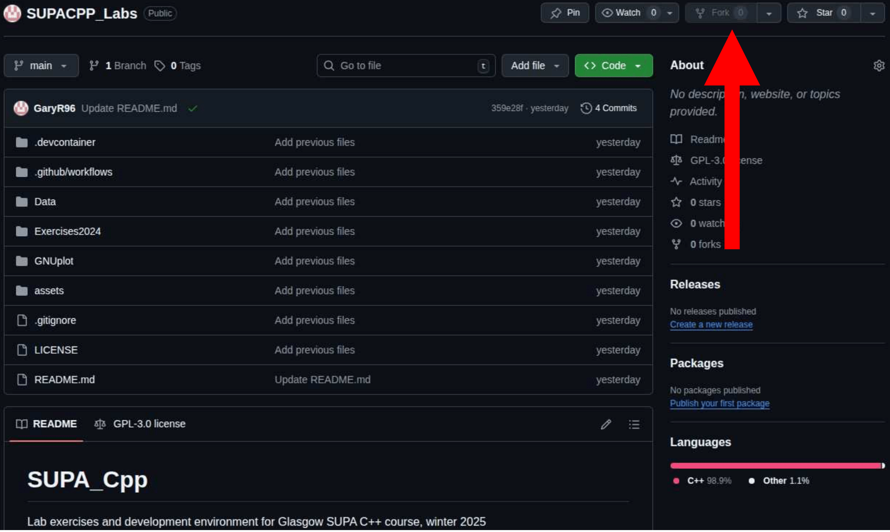
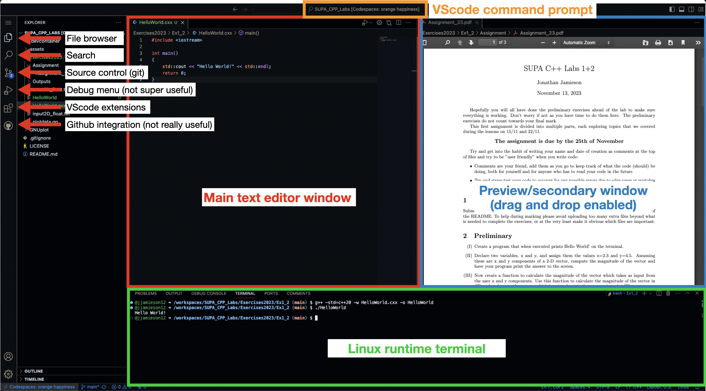

# SUPA C++
Lab exercises and development environment for SUPA C++ course, winter 2025

## Getting started

Welcome to the 2025 SUPA C++ course. As with previous years, the easiest way to develop the code in this course is to use a ready-made development environment utilising [github codespaces](https://github.com/features/codespaces) which makes things run more smoothly and reduces the setup steps needed.

## Github codespaces
With your personal github account you should automatically get 60 core-hours of free codespace usage per month, which should easily be enough for this course. If you go over your allowance it may be possible to extend it for free by registering a student github account but I haven't been able to verify this for obvious reasons.

The codespace is a virtual machine hosting an Ubuntu 22.04.3 image and a few pre-compiled packages. The image is linked to a VScode web-instance which acts as the remote-session host. Part of the setup process will also download a few useful VSCode extensions, as well as the github one. If you know of any others you like to use, feel free to add them.

## Prerequisites:

1) A personal github account
    - Click [here](https://github.com/login) to login or sign up
2) A fork of this repository ([forks](https://docs.github.com/en/pull-requests/collaborating-with-pull-requests/working-with-forks/fork-a-repo) are an easy way for you to get a copy of the base code to build upon)
    - Click [here](https://github.com/GaryR96/SUPACPP_Labs/fork) or on the button shown below:


## Starting and stopping the codespace

On the github page for **your fork** of this repository, then select:\
Green <kbd>< > Code ▾</kbd> icon &rarr; <kbd>Codespaces</kbd> tab &rarr; <kbd>Create codespace on main</kbd>:


This will start spooling up a new codespace instance. The first time you do this it will take a few minutes to setup the virtual machine. After this is done, from now on you should be able to stop and start the codespace almost instantly, with all of your files and settings saved automatically.

When you want to close the codespace, simply closing the tab will not stop it, and will allow it to run until timing out from inactivity. This can quickly **use up your hourly allowance** so please be sure to properly stop the codespace before closing the window. To manually stop a codespace you can click the grey bar on the bottom left and then choose _Stop Current Codespace_:

Alternatively <kbd>shift</kbd>+<kbd>command</kbd>/<kbd>ctrl</kbd>+<kbd>P</kbd> should bring up the command bar and type _Codespaces: Stop Current Codespace_
    
## A quick guide to VSCode

If you have never seen it before the layout of VScode can seem a bit daunting but it is ultimately very functional. The main components of the interface are highlighted below:


The most important parts for the lab are the file browser tab (where you can see your file structure), the main editor window (where you will write your code), the terminal (where you will compile and run it), and the source control (git) tab on the left. Fo more generic info on VSCode, see [here](https://code.visualstudio.com/docs/introvideos/basics).

One slightly unintuitive aspect is that the file browser and terminal are not linked. If you are viewing/opening nested files in the browser, your location in the terminal does not change to match. To run or compile a file somewhere other than the home directory you will need to change directory manually in the terminal using the `cd` command, e.g:

```bash
cd Exercises/Lab1and2/
g++ -std=c++20 -w myScript.cxx -o myScript
```

The source control tab is used to keep track of any changes you make and is what you will use to submit your final code. In the image above the blue 9 next to this icon indicates the number of tracked files that have changed since the last commit. 

## Assignment Submission
When submitting code for the assignments, you can follow the steps below alongside the illustration.
    1. Open the source control tab.
    2. From the list of files with changes, click on each file to see the ```diff``` from the last commit. Make sure the changes highlighted here are as you expect.
    3. Add all of the relevant files.
    4. Write a commit message. 
    5. Finally, click <kbd>commit</kbd> and <kbd>sync changes</kbd>.


If the submission is successful you should see a notification within the GitHub tab that the submission CI check has completed successfully.  